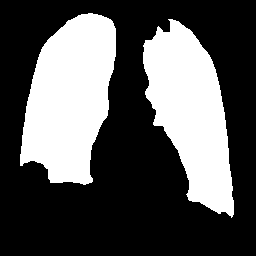

# Lung Segmentation with U-Net 🫁

This project implements a **U-Net convolutional neural network** to segment lungs from chest X-ray images. It includes data preprocessing, training, post-processing, and a FastAPI deployment for real-time prediction.

---

## 📂 Dataset

- Source: [Kaggle - Chest Xray Masks and Labels](https://www.kaggle.com/datasets/nikhilpandey360/chest-xray-masks-and-labels)
- Input: Chest X-ray images (`.png`)
- Output: Binary lung masks (`_mask.png`)

---

## 🚀 Model Architecture

- Based on **U-Net** for image segmentation
- Encoder–Decoder structure with skip connections
- Final activation: `Sigmoid`
- Loss: `Binary Cross Entropy + Dice Loss`

---

## 🧠 Interview Highlights

> If you're reviewing this project for hiring or learning purposes, here are some key design decisions:

- ⚙️ **Combined BCE + Dice Loss**: BCE handles pixel-wise classification, while Dice handles class imbalance and overlap.
- 🧽 **Post-processing with OpenCV**: Morphological operations remove noise and refine predictions.
- 💡 **FastAPI API**: The model can be used as a real-time service.
- 💾 **Used `.state_dict()` for saving**: Allows loading only model weights, not the whole class.

---

## 📈 Sample Output

---

## 🖼️ Inference

Send an image file to the API and get a segmented mask of lungs in return.

---

## 📚 Requirements

- PyTorch
- Albumentations
- OpenCV
- FastAPI
- Uvicorn

---

## 🙋‍♂️ Author

AmirHosein Bodaghi  
[LinkedIn](https://www.linkedin.com/) • [GitHub](https://github.com/)
