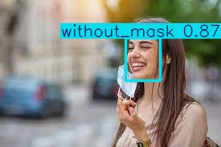

# 😷 Face Mask Detection with YOLOv8

This project uses Ultralytics YOLOv8 to detect face mask usage in images.  
It classifies faces into the following categories:

- `with_mask`
- `without_mask`
- `mask_weared_incorrect`

---

## 📁 Dataset

- Source: Public dataset from Kaggle  
- Format: Converted from Pascal VOC (XML) to YOLO format  
- Split: `train` and `val`  
- Classes: 3

---

## ⚙️ Training Configuration

| Parameter      | Value            |
|----------------|------------------|
| Model          | `yolov8s.pt`     |
| Epochs         | `50`             |
| Batch size     | `8`              |
| Augmentation   | ✅ Enabled (HSV, Flip, Rotation, Scale...) |
| Final mAP@0.5  | `0.854`          |
| Best model     | `mask_detector_v2/best.pt` |

---

## 🖼️ Sample Output



```json
[
  {
    "class": "without_mask",
    "confidence": 0.85,
    "bbox": [342.3, 112.4, 456.1, 212.9]
  },
  {
    "class": "with_mask",
    "confidence": 0.91,
    "bbox": [100.3, 70.5, 154.9, 132.2]
  }
]
```

---

## 🚀 API (FastAPI)

This project includes a REST API built with FastAPI:

- `/predict/` – returns the predicted image
- `/predict-json/` – returns JSON of detected objects

---

## 🛠 How to Run

```bash
pip install ultralytics fastapi uvicorn python-multipart nest-asyncio pyngrok
uvicorn main:app --reload
```

You can test it on Swagger UI at `http://localhost:8000/docs`

---

## 📌 Tech Stack

- Python
- Ultralytics YOLOv8
- FastAPI
- Colab (Training & Testing)
- matplotlib / pyngrok / PIL

---

## ✍️ Author

Developed with ❤️ by AmirHosein Bodaghi
